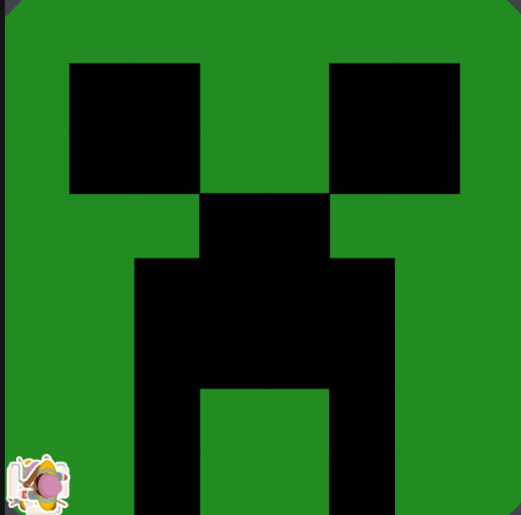

# asphalt-art-project
project Unit 1 
# Unit 1 - Asphalt Art

## Introduction

Cities use asphalt art to improve public safety, inspire their residents and visitors, and brighten communities. Your goal is to create asphalt art to revitalize The Neighborhood and bring the community together with the help of the Painter.

## Requirements

Use your knowledge of object-oriented programming, algorithms, the problem solving process, and decomposition strategies to create asphalt art:
- **Create a new subclass** – Create at least one new subclass of the PainterPlus class that is used for a component of the asphalt art design.
- **Plan an algorithm** – Use the problem solving process and decomposition strategies to plan an algorithm that incorporates a combination of sequencing, selection, and/or iteration.
- **Write a method** – Write at least one method in a PainterPlus subclass that contributes to a component of the asphalt art design.
- **Document your code** – Use comments to explain the purpose of the methods and code segments.

## Notes: Neighborhood & Painter Class

This project was created on Code.org's JavaLab platform using the built-in Neighborhood GUI output. To test and edit this project you must build in Code.org's JavaLab with the Neighborhood GUI enabled. For reference to the Painter class documentation, [you can read more here.](https://studio.code.org/docs/ide/javalab/classes/Painter)

## Output:

 

## Reflection

1. Describe your project.
My porject is a face of Minecrect the Creeper

2. What are two things about your project that you are proud of?
I am proud of how I am able to create multiple painter and multiple method to create this creeper. I alos like how I create a bunch of differnt file for diferent parts of the face. 

3. Describe something you would improve or do differently if you had an opportunity to change something about your project.
I would probally do somthing harder with more detail becuase since now I got the hang of it I think I would be able to do detailed photos. 

4. How is this project related to STEAM (Science, Technology, Engineering, Art, and Mathematics)? Provide explicit examples from the project and details as possible. 
This project is related to STEAM due to the Technology, Enginering, Art being a main assest like learning ways to use methods and different file to create a mural/art, and enginering in our code and seeing if it while work or not. 
5. What SLOs did you demonstrate during completing this project?
Some SLOs that I demonstrated during completing this prjoect is me getting the hang of actual code the methods and calling them in my code and the smae goes for making the file and atcual calling it. 
